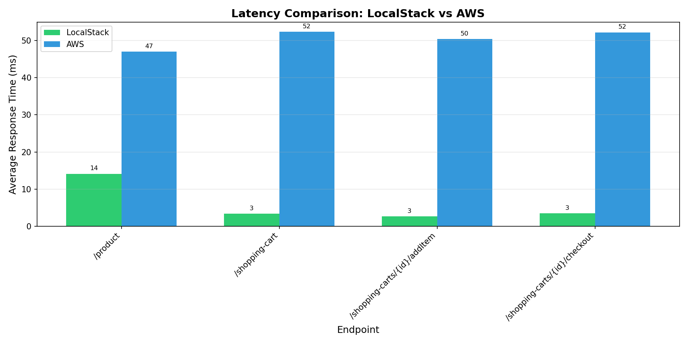
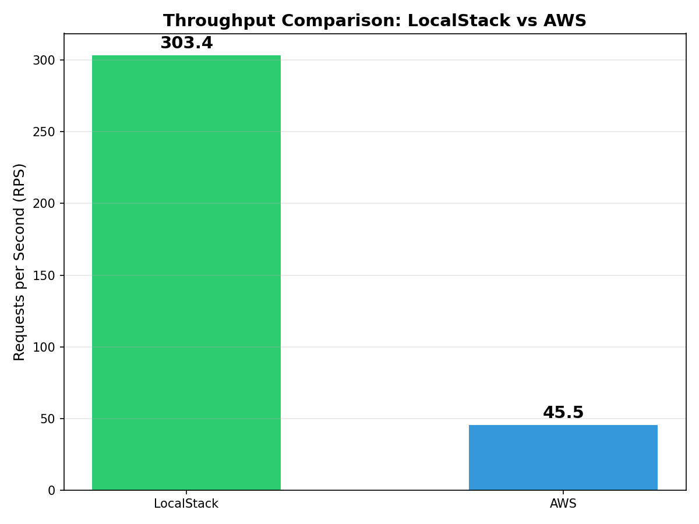
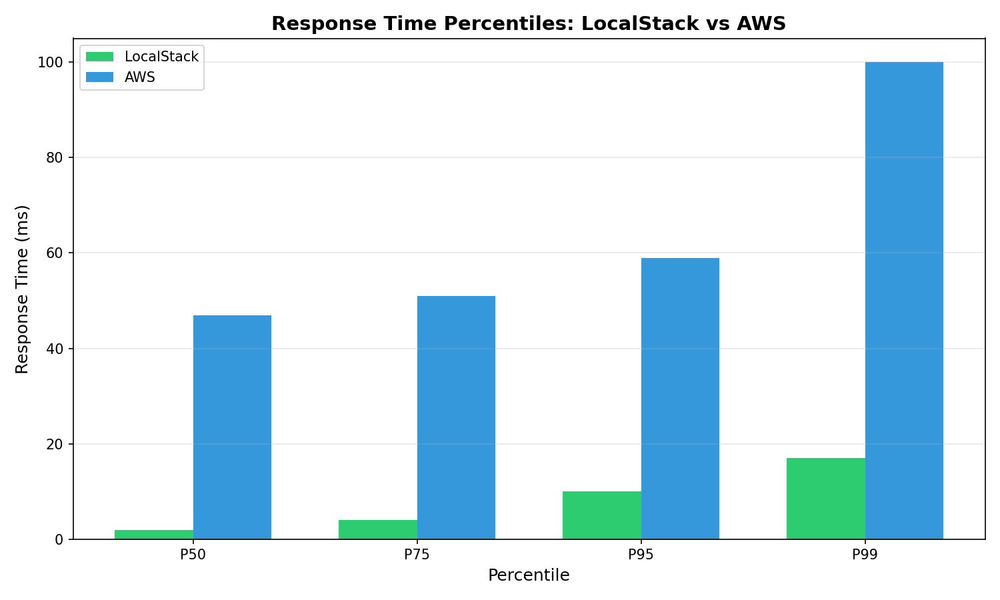
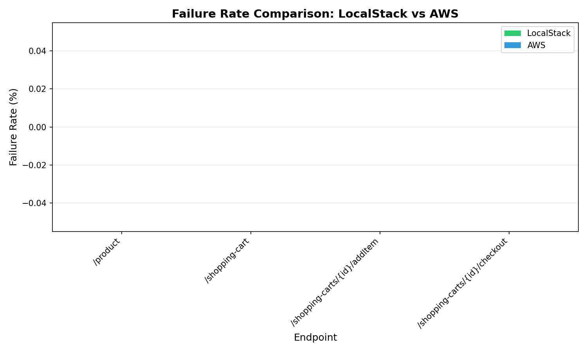
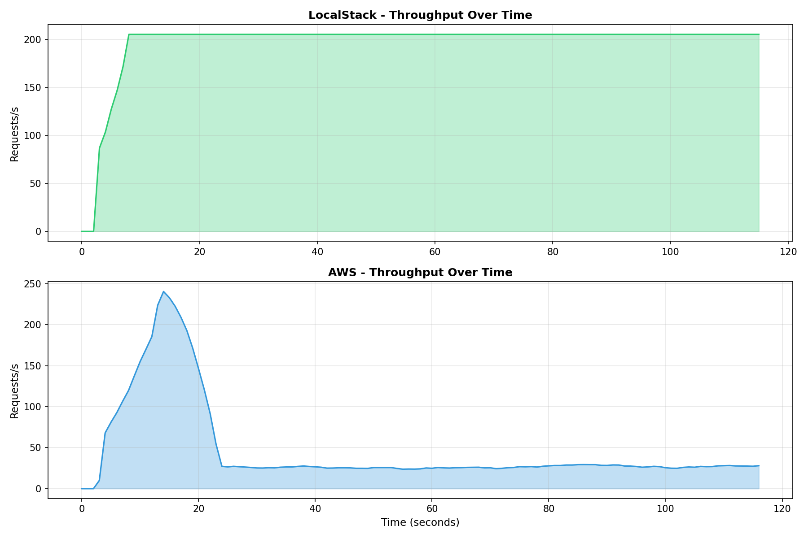

# LocalStack vs AWS Deployment Comparison Report

**Generated:** 2025-11-30 19:24:46

## Executive Summary

This report compares the performance of a microservices architecture deployed on:
1. **LocalStack** - Local AWS emulation
2. **AWS** - Real cloud infrastructure (Learner Lab)

## Performance Comparison

| Metric                    |   LocalStack |     AWS | Difference   |
|:--------------------------|-------------:|--------:|:-------------|
| Total Requests            |      2317    | 5423    | +134.1%      |
| Failed Requests           |         0    |    0    | N/A          |
| Failure Rate (%)          |         0    |    0    | N/A          |
| Avg Response Time (ms)    |         3.52 |   48.88 | +1288.6%     |
| Median Response Time (ms) |         2    |   47    | +2250.0%     |
| P95 Response Time (ms)    |        10    |   59    | +490.0%      |
| P99 Response Time (ms)    |        17    |  100    | +488.2%      |
| Requests/sec (RPS)        |       303.36 |   45.47 | -85.0%       |

## Key Findings

### 1. Latency
- **LocalStack** shows lower latency due to local network (no internet round-trip)
- **AWS** latency includes real network overhead, ALB processing, and ECS scheduling

### 2. Throughput
- Compare RPS (Requests Per Second) between environments
- LocalStack is limited by local machine resources
- AWS can scale with infrastructure

### 3. Response Time Distribution

### 4. Failure Rates
- Product endpoint expected ~25% failure (50% traffic to bad service × 50% failure rate)
- AWS ALB may route away from unhealthy instances (Automatic Target Weights)
- LocalStack/Nginx uses simple round-robin

### 5. Performance Over Time

## Recommendations

| Use Case | Recommended Environment | Reason |
|----------|------------------------|--------|
| Rapid development | LocalStack | Fast iteration, no cost |
| Unit/Integration tests | LocalStack | Quick feedback loop |
| Load testing | AWS | Realistic performance data |
| CI/CD pipeline | LocalStack | Fast, deterministic |
| Pre-production validation | AWS | Real infrastructure behavior |

## Limitations Observed

### LocalStack Limitations
1. ECS Docker Mode networking issues (required manual container startup)
2. ALB routing required Host header workaround
3. Some AWS API behaviors differ from real AWS

### AWS Learner Lab Limitations
1. Limited credits/resources
2. Session timeouts
3. Some services restricted

## Conclusion

LocalStack is valuable for development and testing, but real AWS deployment is essential for:
- Accurate performance benchmarking
- Testing ALB health check behavior
- Validating production-like scenarios
