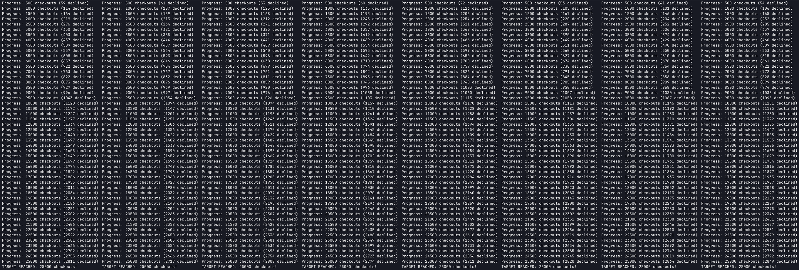
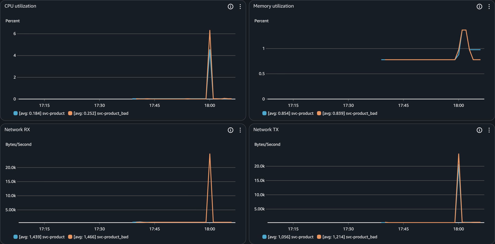
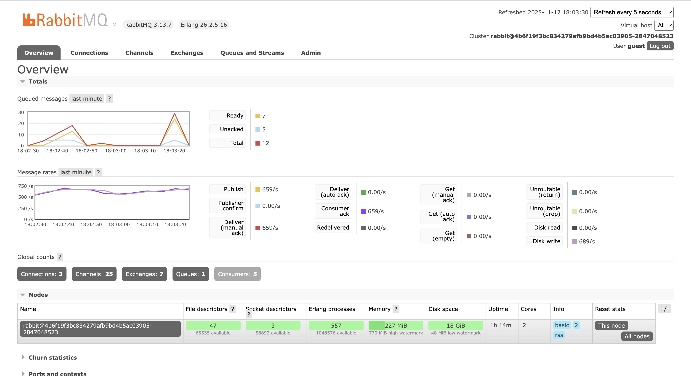
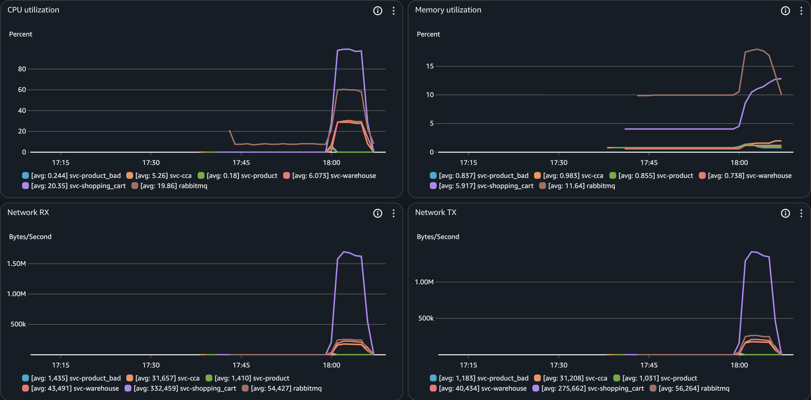

## **Load Test Results**

### **Screenshot 1: Locust Load Test Progress - Multiple Workers**

Terminal output showing Locust test execution across 8 distributed workers, each progressing toward its target of 25,000 checkouts (200,000 total). All workers display active progress with successful checkouts and declined payment counts, demonstrating proper distributed mode setup with even user distribution and successful load generation.

### **Screenshot 2: Load Balancer Behavior - Good vs Bad Product Service**

AWS CloudWatch metrics comparing resource utilization between the good Product service (blue) and the badly-behaved Product service (orange) that returns 503 errors 50% of the time. Both instances show similar resource utilization patterns, indicating roughly equal traffic distribution. This occurs because product creation is too brief (only 1,000 products created during setup phase, completing in seconds) for the Application Load Balancer to detect the bad instance's behavior and adjust routing. The ALB requires sustained traffic over several minutes to gather sufficient health check data and response time statistics before reducing traffic to poorly-performing targets.

### **Screenshot 3: RabbitMQ Queue Depth and Message Rates**

RabbitMQ Management Console shows queue depth staying well below the 1,000 message target (peak of ~30 messages, currently 12 total) with balanced production and consumption rates at 659 messages/second. The system maintains low queue depth throughout the test period, demonstrating proper configuration of client threads and warehouse consumer threads to prevent queue buildup while maximizing throughput.

### **Screenshot 4: All Services Resource Utilization**

AWS CloudWatch metrics showing resource utilization across all microservices during load testing. The Shopping Cart service (purple) shows highest CPU (~95% peak) and network usage as the main transaction coordinator, while other services maintain moderate, stable resource consumption. The system demonstrates healthy distributed load handling with no service crashes or resource exhaustion under sustained high throughput.